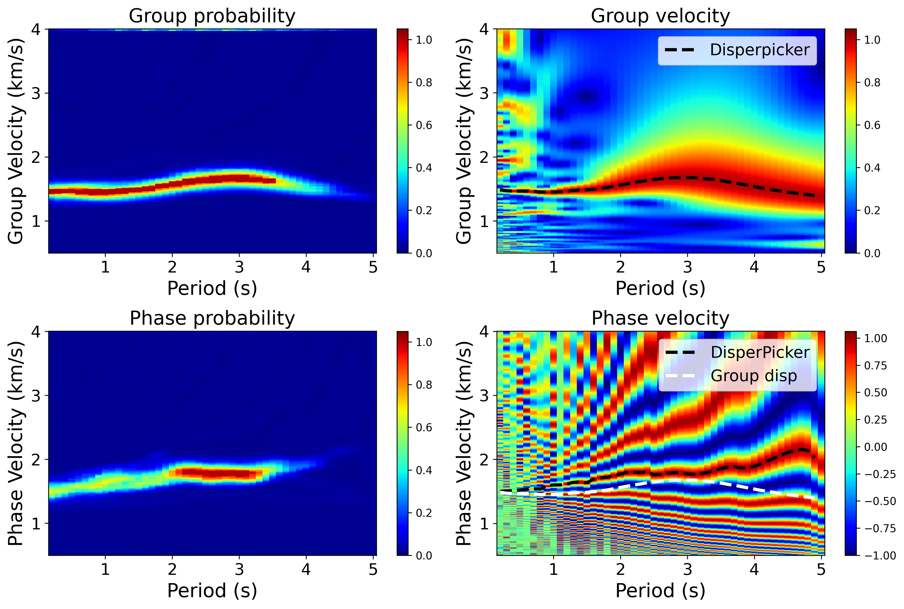
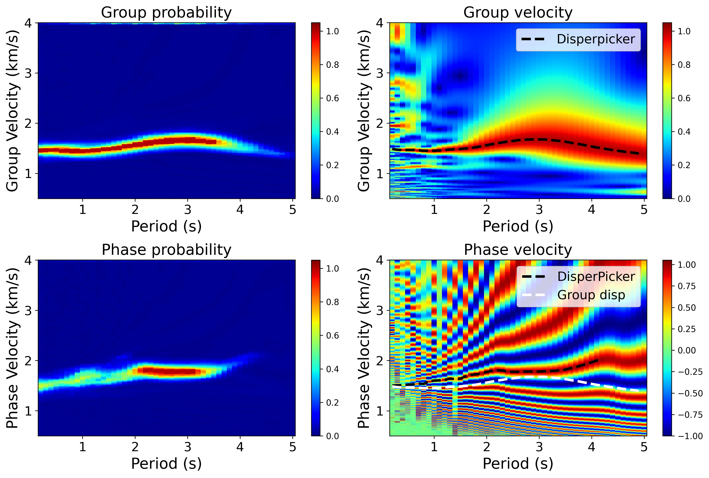
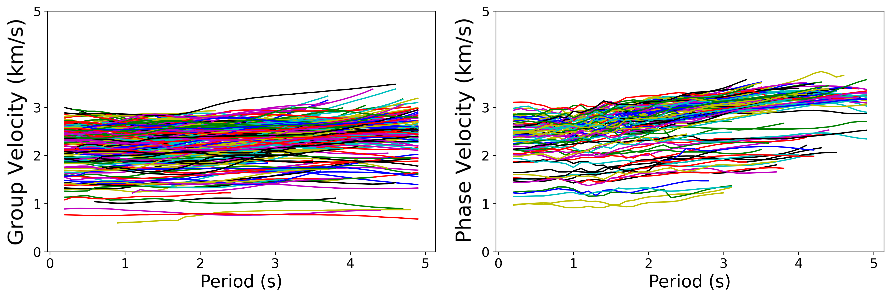
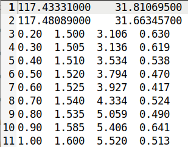

# EGFAnalysisPy

* 基于图像分析方法（Yao, van der Hilst, de Hoop, 2006, GJI; Yao et al., 2005, PEPI; Yao et al., 2011, C.R.Geoscience），从经验格林函数或互相关函数中计算面波群速度及相速度频散能量图
* 使用基于人工智能的频散曲线提取方法DisperPicker（Yang et al., 2022, SRL）从频散能量图中自动提取频散曲线

## 1. 安装

* 平台：Linux
* Python 3.6
* 安装Python依赖包： `pip install -i https://pypi.tuna.tsinghua.edu.cn/simple -r requirements.txt`

## 2. 使用

* 修改`config.py`中的参数，其中包括`EGFAnalysisTimeFreq`的参数以及`DisperPicker`的参数，参数说明详见`config.py`

* 运行: `python run.py` 

* 主要流程及代码：

  ``` Python
  ## 对于每个CF/EGF计算了一次群速度能量和两次相速度能量，提取了两次
  # 初始化
  gfcn = EGFAnalysisTimeFreq.gfcn_analysis(...) 
  pick = Pick()
  # 1. 无时变滤波，计算群速度及相速度能量图
  group_image = gfcn.GroupVelocityImgCalculate()
  phase_image = gfcn.PhaseVelocityImgCalculate(TimeVariableFilter=gfcn.TimeVariableFilterType.no)
  # 2. DisperPicker拾取拾取群速度及相速度
  group_velocity, phase_velocity, ... = pick.pick(group_image, phase_image, ...)
  # 3. 时变滤波，利用拾取的群速度加窗，重新计算相速度能量图
  gfcn.GroupDisperCurve = group_velocity
  phase_image = gfcn.PhaseVelocityImgCalculate(TimeVariableFilter=gfcn.TimeVariableFilterType.obs)
  # 4. 再次拾取群速度及相速度
  group_velocity, phase_velocity, ... = pick.pick(group_image, phase_image, ...)
  # 5. 质量控制，参数说明详见DiperPicker/qc.py
  group_velocity = qc.qc(group_velocity, ...)
  phase_velocity = qc.qc(phase_velocity, ...)
  ```

## 3. 结果

* 无时变滤波结果

   （左：`DisperPicker`预测概率图；右：频散能量图及拾取的频散曲线；上：群速度；下：相速度）

   

* 有时变滤波结果

   

* 提取出的全部频散曲线：

   

* 默认结果存储位置为 `./DisperPicker/result/` ，包括有质量控制和无质量控制的结果

* 频散文件格式：周期   速度   信噪比   `DisperPicker`预测概率

    

## 4. 迁移学习

* 不冻结某些层

* 修改`config.py`中相应的参数，以部分长宁数据迁移学习为例，将数据分为训练集（`DisperPicker/data/TrainingData`）与验证集（`DisperPicker/data/ValidationData`），将频散能量图（`dv = 0.005 km/s`）与频散曲线放入相应文件夹下

* 训练参数可使用config_train.py：

  ```bash	
  cp cofig_train.py config.py
  ```

* 开始迁移学习：

  ```bash
  python transfer_learning.py
  ```

* 新训练的模型：`DisperPicker/saver/`，`DisperPicker/saver/checkpoint`中记录了当前DisperPicker使用的模型，以及保存的所有网络模型的路径
* 进入`DisperPicker/result/validation_result`查看迁移学习模型在验证集中的表现
* 迁移模型使用同  **2. 使用**


